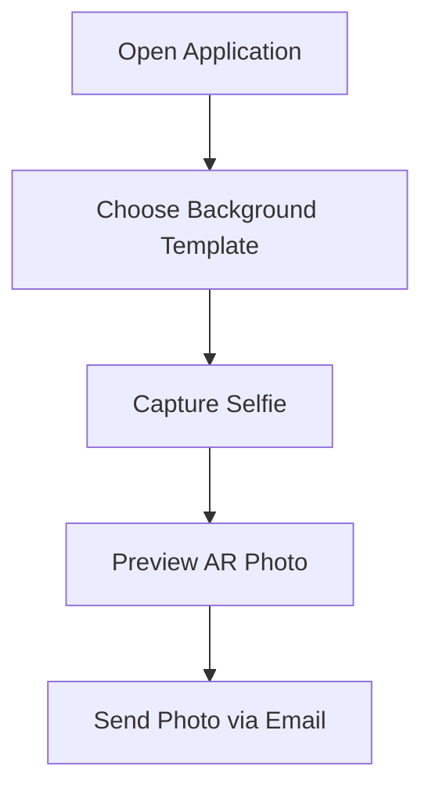

<h1 align="center">📸 AR Selfie Booth</h1>

An interactive Unity-based Augmented Reality selfie application that allows users to capture interactive selfies with virtual background templates in real time. Users can choose themed backgrounds, take immersive AR photos, and instantly send the captured image to their email directly from the application.

---

## ✨ Features

<table>
<tr>
<td>📸</td>
<td><b>Real-time AR Selfie Capture</b></td>
</tr>

<tr>
<td>🖼️</td>
<td><b>Virtual Background & Template Overlay</b></td>
</tr>

<tr>
<td>✨</td>
<td><b>Interactive and Immersive Photo Experience</b></td>
</tr>

<tr>
<td>📧</td>
<td><b>Email Integration for Sending Captured Photos</b></td>
</tr>

<tr>
<td>💻</td>
<td><b>Simple and User-Friendly Interface</b></td>
</tr>

<tr>
<td>🚀</td>
<td><b>Fast Photo Processing and Sharing</b></td>
</tr>

</table>

---

## ⚙️ How It Works

## 🛠️ Technologies Used

| Technology | Purpose |
|---|---|
| Unity Engine | Core Application Development |
| C# | Application Logic |
| Augmented Reality (AR) | AR Experience |
| Camera/Image Processing | Selfie Capture |
| Email Integration | Photo Sharing |

---

## 🎯 Use Cases

- 🎪 Event Photo Booths  
- 📢 Marketing Campaigns  
- 🌍 Virtual Tourism Experiences  
- 🎉 Entertainment & Social Sharing  
- 🖥️ Interactive Exhibition Kiosks  

